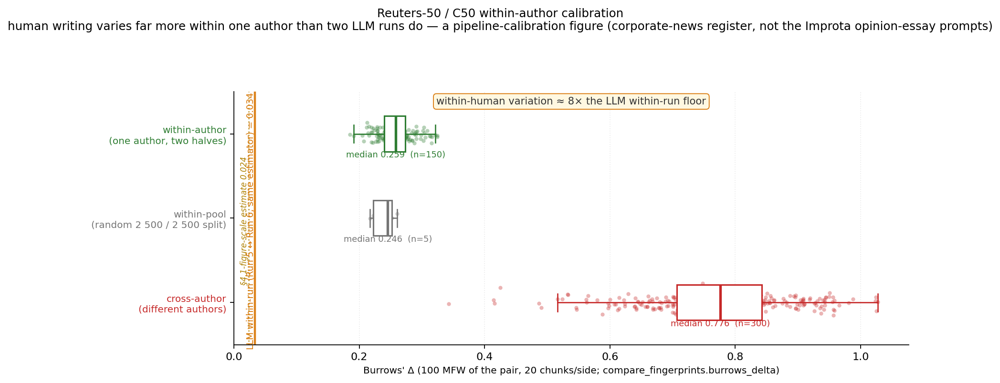
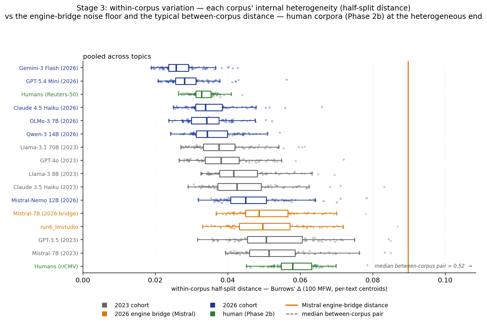
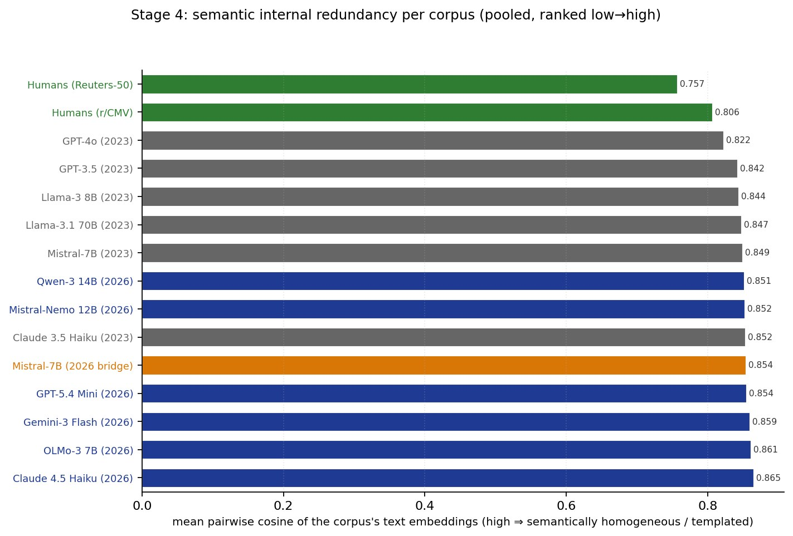

# Human baseline — supplementary material

*Companion to "Beyond 'AI Language': The case for the idiolectal nature of LLM output" (Rudnicka & Juzek, [arXiv:2608.06589](https://arxiv.org/abs/2608.06589)). This is the analysis referenced in §4, item (iv) of the chapter, which carries a pointer to this repository rather than the analysis itself. It is **not** part of the chapter main text: the human reference set is deliberately reported here, because it is not prompt-matched to the LLM generation task and therefore cannot serve as a like-for-like comparison. It is included so that readers can see how the model-to-model differences reported in the chapter compare against a human point of reference.*

> **Reproducing the numbers below.** The human reference corpora are not redistributed here. Run `scripts/prepare/download_human_baseline.py` (Webis-CMV-20 from Zenodo, Reuters-50/C50 from UCI) then `scripts/prepare/build_human_baseline.py`, which rebuilds the exact working subsets from the locked `FILTER_CONFIG`. Cited figures name their source CSV under `results/phase2_mapping/`, regenerated by the scripts listed in [`../docs/ANALYSES.md`](../docs/ANALYSES.md).

## 1. Why a separate human baseline

The chapter's central comparison is **model versus model**: do individual LLMs have stable, distinguishable linguistic profiles, and have those profiles shifted between the 2024 and 2026 cohorts? A human comparison is informative as an outer reference point, but no openly available English corpus is *prompt-matched* to the Improta task (same four topics, same instruction, single-author multi-text structure). Rather than compare against a mismatched corpus in the main analysis, we built two human reference sets for specific, bounded purposes and document them here.

## 2. Corpora

| Corpus | Role | Texts | Authors | Notes |
|---|---|---|---|---|
| Webis-CMV-20 (Reddit r/ChangeMyView) | cross-author topic reference | ~741 topic-rows (583 unique posts) | most posts distinct authors | CC-BY 4.0; keyword-filtered into the four topics |
| Reuters-50 / C50 (Reuters Corpus, CCAT) | within-author calibration | 5,000 (100 × 50) | 50 | corporate-news register; topic-controlled by construction |

**Webis-CMV-20** opinion posts were sorted into the four chapter topics by a transparent, case-insensitive keyword filter over title and body (lists and per-topic counts in the repository manifest, `webis_filter_config.json`). The match counts are: climate ~427, global_warming ~135 (a subset of climate), misinfo_health ~142, math_anxiety ~37.

**Reuters-50** is used only by the within-author calibration (100 documents per author lets us measure how much one writer varies across their own texts); it is not a topic corpus.

## 3. What the human baseline shows

The consistent finding is that **human writers vary more than any model**, on every measure of variation we computed.

- **Within-author variation** (`stage2_within_author_baseline/summary.csv`). Measuring one author's texts against their own, the median Burrows' Δ is **0.259** (cross-author 0.776). The corresponding figure for a model measured against an independent re-run of itself is **≈0.034** — i.e. a single human author is about **8× more internally variable** than a single model. A human author's self-variation is on the order of the distance between *different* models at the close end.
- **Within-corpus stylometric spread** (`stage3_within_corpus_variation/summary.csv`, split-half Burrows' Δ, pooled). The human Reddit corpus is the **most internally heterogeneous** of all (Webis ≈ **0.058**); the models range 0.026–0.051, with the 2026 closed-API models the most homogeneous (Gemini ≈ 0.026, GPT-5.4-Mini ≈ 0.028).
- **Semantic redundancy** (`stage4_embedding_map/summary.csv`, mean internal cosine; higher = more redundant). Humans are the most semantically diverse (Reuters 0.757, Webis 0.806); the 2024 models sit at 0.82–0.85 and the 2026 models are the most redundant (up to 0.865 for Claude-4.5-Haiku).
- **Distance from the human corpus** (`stage2_distance_matrix_with_human/matrices/burrows_delta__pooled.csv`). Human prose is a *modest* outgroup: every model sits **0.52–0.76** (Burrows' Δ) from the Reddit corpus, against a median model-to-model distance around 0.5. Interestingly the **2026 cohort is closer to human prose than the 2024 cohort** (closest: OLMo-3-7B 0.52, Gemini-3-Flash 0.53, GPT-5.4-Mini 0.54; farthest: GPT-3.5 0.76).
- **Perplexity under a fixed 2019 yardstick** (`stage4_perplexity/summary.csv`, GPT-2-large). The 2026 closed-API models drift up *toward* the human region (Gemini 13.7, GPT-5.4-Mini 14.0, Claude-4.5-Haiku 16.2; humans: Reuters 15.6, Webis 15.8), whereas the 2024 models and the Mistral bridge are much lower (≈5–8).

**Bearing on the chapter's argument.** That a single model is markedly *more* self-consistent than a single human author supports — rather than undercuts — the stability criterion that makes "idiolect" an apt frame: the model's voice is at least as stable as, and considerably more uniform than, an individual human's.

## 4. Caveats

- **Not prompt-matched.** Neither human corpus uses the LLM instruction/topic protocol; within-human, within-prompt variation remains unmeasured in English. This is the reason the baseline is supplementary.
- **"math (broad)" / "climate (broad)".** r/ChangeMyView contains almost no genuine *fear-of-math* content; the 37 `math_anxiety` matches are math-*education* posts. The `climate` filter spans climate science, policy and energy debate — broader than the LLM `climate` prompt. Both are labelled "(broad)".
- **Keyword filtering, not annotation.** Deterministic substring matching: reproducible and auditable, but with known recall/precision limits; topic sets are non-disjoint.
- **Topic names denote subject, not property.** "misinfo_health" etc. describe what a text is *about*; neither the LLM texts nor the CMV posts are themselves misinformation — they are opinions/debates, matching the Improta prompt.
- **Reuters is corporate-news register, calibration-only** — a pipeline calibration of the within-author measure, not a within-human estimate for opinion-essay prompts.
- **Engine confound** applies to the non-Mistral 2024 models (no 2026 re-run exists for them), as in the chapter.
- **GPT-2-large is a 2019 yardstick.** Perplexity measures distance from a 2019 web-text model's expectations, not intrinsic fluency.

## 5. Figures

*Within-author versus cross-author Burrows' Δ, Reuters-50. A single author's texts measured against their own sit well below the cross-author distribution, but far above the model self-distance.*

*Split-half within-corpus Burrows' Δ, pooled. The human Reddit corpus is the most internally heterogeneous; the 2026 closed-API models are the most homogeneous.*

*Mean internal cosine similarity (higher = more redundant). Humans are the most semantically diverse; the 2026 models the most redundant.*

## 6. Reproducibility

The corpora themselves are not redistributed. `scripts/prepare/download_human_baseline.py` fetches the sources, `scripts/prepare/build_human_baseline.py` rebuilds the exact working subsets from the locked `FILTER_CONFIG` (in the script), and `scripts/analyse/within_author_baseline.py` / `scripts/analyse/within_corpus_variation.py` produce the numbers above. Provenance manifests are written by the build script on each run rather than shipped, so no per-text identifiers are distributed with this repository. See [`../docs/ANALYSES.md`](../docs/ANALYSES.md) for the full command sequence.

> **AI-assistance** -- this document was written with substantial AI assistance (Claude Opus 4.7) and the final version was approved by the authors.
